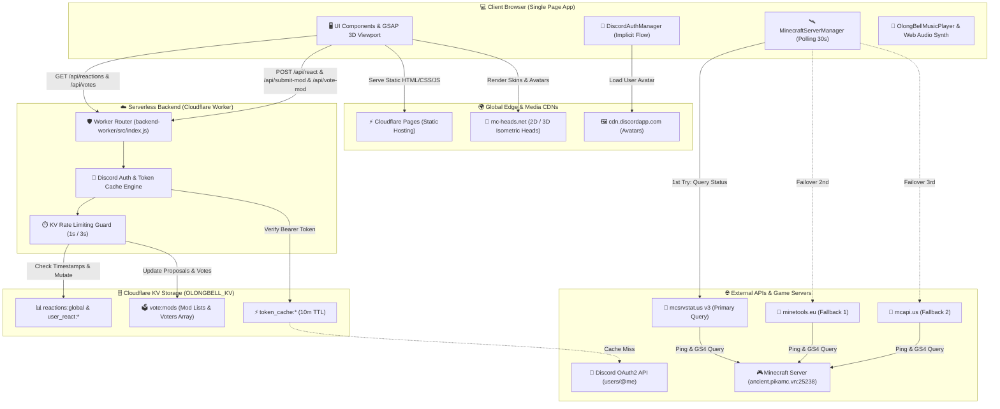
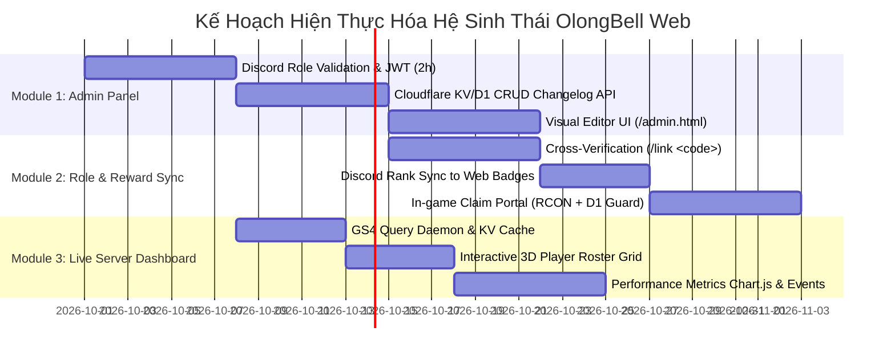

<div align="center">

  

  # 🦊 OlongBell SMP — Official Web Portal & Changelogs ⚔️
  
  **Trung tâm Nhật ký Cập nhật & Hệ Sinh Thái Máy Chủ Minecraft Fabric 26.2**
  
  *Giao diện Đồ họa 3D Cylinder • Server Radar Thời Gian Thực • Trình Phát Nhạc OST • Bình Chọn Mod Cộng Đồng*

  <p align="center">
    <a href="https://fabricmc.net/"></a>
    <a href="https://workers.cloudflare.com/"></a>
    <a href="https://discord.gg/37MB8CR28K"></a>
    <a href="https://greensock.com/gsap/"></a>
    
    
    
  </p>

  **[📡 Kết Nối Máy Chủ](#-2-thông-tin-máy-chủ-live-server-radar)** •
  **[✨ Tính Năng Nổi Bật](#-3-tính-năng-nổi-bật-key-features-showcase)** •
  **[🏛️ Kiến Trúc](#-4-sơ-đồ-kiến-trúc-hệ-thống-system-architecture)** •
  **[📁 Thư Mục](#-5-cấu-trúc-thư-mục-dự-án-project-structure)** •
  **[🚀 Khởi Chạy & Deploy](#-6-hướng-dẫn-khởi-chạy-cục-bộ--triển-khai-installation--deployment)** •
  **[📚 REST API](#-7-bảng-tra-cứu-rest-api-documentation)** •
  **[💀 Update 5.0](#-8-điểm-nhấn-siêu-bản-cập-nhật-update-50)** •
  **[🗺️ Lộ Trình](#-9-lộ-trình-phát-triển-tương-lai-roadmap)** •
  **[🤝 Cộng Đồng](#-10-cộng-đồng-đóng-góp--bản-quyền-credits)**

</div>

---

## 📖 1. Giới thiệu Tổng quan (About Project)

**OlongBell Changelogs Web** là cổng thông tin điện tử chính thức và trung tâm tương tác của máy chủ **OlongBell SMP** — máy chủ sinh tồn Minecraft hiện đại vận hành trên nền tảng **Fabric 26.2 (Minecraft 1.21.1)**.

Dự án lấy cảm hứng từ linh vật hồ ly tinh nghịch **Shirakami Fubuki** (Hololive Gamers), kết hợp bảng màu cổ điển *Warm Linen & Charcoal Sand Gold* với ngôn ngữ thiết kế vi mô hiện đại. Trang web giải quyết trọn vẹn 5 nhu cầu thiết yếu của người chơi:
1. 📜 **Nhật Ký Cập Nhật Trực Quan:** Đọc và tương tác với các bản cập nhật lớn (v1.0.0 $\rightarrow$ v5.0.0) qua vòng xoay 3D hoặc danh sách thẻ bài chuẩn mực.
2. 📡 **Giám Sát Máy Chủ Thời Gian Thực:** Nắm bắt số lượng người chơi, kiểm tra ping, xem avatar 2D/3D của các thành viên đang online trong game.
3. 🎵 **Trải Nghiệm Thư Giãn:** Tận hưởng 6 bản nhạc nền lofi/chilled chọn lọc với trình phát đĩa than xoay động và âm thanh tổng hợp đa tần số.
4. 🗳️ **Dân Chủ Hóa Máy Chủ (Mod Voting):** Đăng nhập Discord an toàn để bình chọn hoặc đề xuất các mod mới từ CurseForge/Modrinth.
5. ⚡ **Cài Đặt Siêu Tốc (1-Click Installer):** Hỗ trợ lệnh PowerShell tự động hóa 100% quá trình cài đặt modpack cho người chơi mới.

---

## 📡 2. Thông tin Máy chủ (Live Server & Radar)

Người chơi có thể tham gia trực tiếp máy chủ sinh tồn OlongBell SMP thông qua thông số kết nối sau:

| Thông Số | Giá Trị Cấu Hình | Chú Thích Kỹ Thuật |
| :--- | :--- | :--- |
| **🌐 Public Server IP** | `olongbel.raumasmp.online` | Địa chỉ tên miền chính thức cho người chơi kết nối |
| **🛰️ Internal Query Host** | `ancient.pikamc.vn:25238` | Cổng truy vấn GS4 viễn thám người chơi và MOTD |
| **⚙️ Server Platform** | **Fabric 26.2 (Minecraft 1.21.1)** | Fabric Loader `0.19.3` • Fabric API `0.156.0+26.2` |
| **🔐 SFTP Port** | `ancient.pikamc.vn:2022` | Cổng truyền tải tệp dữ liệu máy chủ an toàn |
| **🤖 Remote MCP Admin** | `http://ancient.pikamc.vn:25240/mcp` | Máy chủ Model Context Protocol quản trị console |

> [!TIP]
> Trên giao diện web, bạn chỉ cần bấm vào ô **IP Máy Chủ** trên thanh Navbar để tự động sao chép địa chỉ `olongbel.raumasmp.online` vào bộ nhớ đệm (Clipboard) với âm báo phản hồi.

---

## ✨ 3. Tính năng Nổi bật (Key Features Showcase)

```
┌───────────────────────────────────────────────────────────────────────────────────────┐
│                               OLONGBELL SUITE FEATURES                                │
├───────────────────────┬───────────────────────────┬───────────────────────────────────┤
│  🪐 3D GSAP Cylinder  │  📡 Real-time Radar       │  🎵 Floating Vinyl OST Player     │
│  🗳️ Discord Mod Vote  │  ⚡ 1-Click PS1 Installer │  ✨ Constellation Cursor Follower │
└───────────────────────┴───────────────────────────┴───────────────────────────────────┘
```

### 🪐 3.1. GSAP 3D Cylinder Carousel & Standard Feed Switcher
- **Toán học Hình trụ Không gian:** Sử dụng hình học giải tích để xếp $N$ thẻ bài xung quanh một trục tròn xoay ảo với bán kính tối ưu:
  $$R = \frac{W / 2}{\tan(\pi / N)}$$
  *(với $W = 320\text{px}$ là bề rộng mỗi thẻ cập nhật).*
- **Cuộn Chuột Scrubbing:** Tích hợp [`GSAP 3.12.5 ScrollTrigger`](file:///C:/Users/giath/minecraft-changelogs-web/scripts/gsap-carousel.js) điều khiển góc xoay của sân khấu đủ $360^\circ$ theo tiến độ cuộn trang.
- **Kéo Thả Tự Nhiên (Drag-to-Rotate):** Hỗ trợ kéo chuột trái hoặc vuốt cảm ứng trên màn hình cảm ứng để xoay vòng xoay 3D với trạng thái chuột `grab`/`grabbing`.
- **Nhận Diện Thẻ Chính Diện (Active Front Card):** Tự động tính toán góc lệch để đẩy độ nét và độ mờ (opacity $1.0$ cho thẻ đối diện, hạ dần xuống $0.45$ cho các thẻ phía sau).
- **Bộ Chuyển Đổi Chế Độ Xem (View Mode Switcher):** Nút chuyển 1 chạm giữa **3D Preview** và **Standard Feed** (Danh sách thẻ truyền thống) kèm bộ lọc phân loại danh mục: *All, Features, Bug Fixes, Balance, Performance, Events*.

### 📡 3.2. Real-time Minecraft Server Radar
- **Kiến trúc Thăm dò Thác lũ (3-Tier Cascading Fallback):** Được quản lý bởi lớp [`MinecraftServerManager`](file:///C:/Users/giath/minecraft-changelogs-web/scripts/minecraft-server.js#L1-L200) nhằm đảm bảo tỷ lệ sống sót cao nhất của widget:
  1. *Cấp 1 (Primary):* `https://api.mcsrvstat.us/3/ancient.pikamc.vn:25238` (Timeout 8,000ms).
  2. *Cấp 2 (Fallback 1):* `https://api.minetools.eu/ping/ancient.pikamc.vn/25238` (Timeout 6,000ms).
  3. *Cấp 3 (Fallback 2):* `https://mcapi.us/server/status?ip=ancient.pikamc.vn&port=25238` (Timeout 6,000ms).
- **Roster Avatar Người Chơi 2D/3D:** Bóc tách danh sách người chơi online và hiển thị avatar trực tiếp từ `mc-heads.net` (`/avatar/{name}` và `/head/{name}` 3D isometric).
- **Observer Pattern:** Các thành phần UI (Header IP Box, Hero Radar, Live Badge) đăng ký lắng nghe sự kiện thay đổi dữ liệu máy chủ để tự động render lại sau mỗi chu kỳ 30 giây.

### 🎵 3.3. Floating Animated OST Music Player & Procedural Sound Synth
- **Trình Phát Đĩa Than Xoay Nổi:** Widget nghe nhạc thu nhỏ góc màn hình với đĩa than xoay tròn 360° khi phát (`.playing`), hiển thị thanh sóng âm dao động (Wave bars), playlist nổi và thanh trượt âm lượng mượt mà.
- **Playlist 6 Bản Nhạc Đặc Sắc:**
  1. `Mad Trick` (`assets/music/1.-Mad-Trick.mp3`)
  2. `Somebody` (`assets/music/4.-Somebody.mp3`)
  3. `Someday` (`assets/music/5.-Someday.mp3`)
  4. `Somewhere` (`assets/music/6.-Somewhere.mp3`)
  5. `Somehow` (`assets/music/Somehow.mp3`)
  6. `Snow Globe` (`assets/music/Snow Globe.mp3`)
- **Vượt Rào Cản Autoplay Của Trình Duyệt:** Tự động lắng nghe tương tác đầu tiên của người dùng (Click chuột, nhấn phím, click nút "Explore") hoặc kích hoạt sau khi màn hình loading kết thúc để chọn phát ngẫu nhiên 1 bản nhạc với âm lượng chuẩn hóa **`25%`** (tránh giật mình).
- **Tổng Hợp Âm Thanh Thủ Tục (Web Audio API Synthesizer):** Không dùng file audio rời, sử dụng trực tiếp các dao động sóng `sine` và `triangle` trong [`scripts/ui-interactions.js`](file:///C:/Users/giath/minecraft-changelogs-web/scripts/ui-interactions.js) để tạo hiệu ứng âm thanh tiếng chuông ngân (`playReactionSound`), tiếng bọt khí pop (`playVoteSound`) và âm trầm xóa mod (`playDeleteSound`).

### 🗳️ 3.4. Community Mod Voting & Discord OAuth2
- **Xác Thực Discord Implicit Grant:** Đăng nhập an toàn qua Discord OAuth2, tự động ẩn hash token trên URL thanh địa chỉ bằng `window.history.replaceState()`, tải avatar động từ Discord CDN.
- **Kiểm Duyệt Nguồn Mod Khắt Khe:** Bộ lọc Regex yêu cầu đường link đề xuất phải thuộc **CurseForge** (`curseforge.com/minecraft/mc-mods/...`) hoặc **Modrinth** (`modrinth.com/mod/...` hoặc `/project/...`).
- **Phân Quyền & Anti-Spam Toàn Diện:**
  - Token Discord được cache 10 phút tại Cloudflare KV để tránh bị Discord giới hạn lượt gọi (HTTP 429).
  - Rate limit cá nhân: Cách nhau 1 giây cho reaction, cách nhau 3 giây cho mỗi lần đề xuất mod.
  - Phân quyền Quản trị viên: Chỉ tài khoản Admin tối cao (`thinhdost`) mới có quyền xóa mod vi phạm trực tiếp từ giao diện.

### ⚡ 3.5. 1-Click PowerShell Modpack Installer
- **Tự Động Hóa 100% Khâu Cài Đặt:** Hộp giả lập terminal macOS/PowerShell với cú pháp màu trực quan, cho phép game thủ mới cài đặt toàn bộ modpack server mà không cần am hiểu kỹ thuật:
  ```powershell
  irm https://raw.githubusercontent.com/QuangquyNguyenvo/MineServer/main/26.2/UpdateMinecraftMods.ps1 | iex
  ```
- **Nút Sao Chép 1-Chạm:** Tích hợp phản hồi xúc giác đồ họa (đổi icon check xanh và thông báo đã sao chép).

### ✨ 3.6. Ambient Particle Spotlight Cursor Follower
- **Mạng Lưới Chòm Sao Tinh Tú (Constellation Canvas):** Tự động tính toán mật độ hạt dựa trên độ phân giải màn hình $\frac{\text{Width} \times \text{Height}}{14,000}$.
- **Tương Tác Vật Lý:** Vẽ các đường liên kết mạng nhện giữa các hạt trong bán kính $120\text{px}$ và kéo tia sáng vào con trỏ chuột trong bán kính $180\text{px}$. Khi con trỏ di chuyển vào vùng $<80\text{px}$, sinh lực đẩy hạt dạt ra xa (Repulsion Force).
- **Spotlight Hover Xuyên Tâm:** Bắt tọa độ chuột truyền vào biến CSS `--mouse-x` và `--mouse-y` để tạo hiệu ứng quầng sáng xuyên thấu theo con trỏ chuột trên từng thẻ cập nhật.

---

## 🏛️ 4. Sơ đồ Kiến trúc Hệ thống (System Architecture)

Dưới đây là sơ đồ luồng dữ liệu toàn cảnh giữa Client Trình duyệt, Backend Cloudflare Worker, Cơ sở dữ liệu phân tán KV, Máy chủ Discord API và Máy chủ Minecraft Query:



---

## 📁 5. Cấu trúc Thư mục Dự án (Project Structure)

Toàn bộ cây mã nguồn của dự án được tổ chức mô-đun hóa, phân định rõ ràng giữa tầng hiển thị giao diện, tài nguyên media và dịch vụ máy chủ biên:

```
minecraft-changelogs-web/
├── 📄 index.html                      # Khung giao diện đơn trang SPA (Loading, Hero Radar, 3D Stage, Mod Vote)
├── 📄 UPDATE_5_0_AGENT_CHANGELOG.md   # Đặc tả kỹ thuật chi tiết của Update 5.0 (Boss Scarpet, Modpack, Cảnh báo)
├── 📄 BACKUP_RESTORE_GUIDE.md         # Hướng dẫn thao tác khôi phục nhanh dành cho kỹ sư tiếp quản
├── 📄 package-lock.json               # Khóa phiên bản các gói phụ thuộc node
├── 📄 .gitignore                      # Danh sách tệp loại trừ (chặn file binaries nặng >100MB)
│
├── 📂 assets/                         # Tài nguyên đồ họa, hình ảnh động và âm thanh
│   ├── 🖼️ fubuki_nobg_next_to_title.webp  # Ảnh mascot Fubuki tiêu đề chính
│   ├── 🖼️ fubuki_character.webp       # Chân dung nhân vật Fubuki tại Hero section
│   ├── 🖼️ fubuki_sleep-removebg.webp  # Linh vật Fubuki ngủ cho màn hình Loading
│   ├── 🖼️ fubuki_walk.gif             # Hoạt ảnh Fubuki bước đi dưới chân trang
│   ├── 🖼️ fubuki_logo.png             # Logo thương hiệu OlongBell Fubuki
│   ├── 🖼️ donate.png                  # Mã QR ngân hàng ủng hộ máy chủ
│   ├── 🖼️ armor.webp, nether_goblin.webp, update3/4/5.png # Ảnh minh họa nội dung updates
│   ├── 🖱️ cursor_default.cur, cursor_pointer.cur          # Con trỏ chuột Minecraft tùy biến
│   └── 📂 music/                      # Nhạc nền định dạng MP3 chất lượng cao
│       ├── 🎵 1.-Mad-Trick.mp3, 4.-Somebody.mp3, 5.-Someday.mp3
│       ├── 🎵 6.-Somewhere.mp3, Somehow.mp3, Snow Globe.mp3
│       └── 🎵 Intro-Voice.mp3         # Giọng chào anime mở màn
│
├── 📂 scripts/                        # Lớp mã nguồn JavaScript hướng đối tượng (OOP ES6+)
│   ├── 📜 app.js                      # Entry point khởi tạo và xâu chuỗi toàn bộ hệ thống
│   ├── 📜 auth.js                     # Quản lý phiên đăng nhập Discord OAuth2 Implicit Grant
│   ├── 📜 changelogs-data.js          # Dữ liệu tĩnh các bản cập nhật v1.0 -> v5.0 và Sneak Peeks
│   ├── 📜 cursor-effect.js            # Vẽ mạng lưới chòm sao Canvas và hiệu ứng tương tác chuột
│   ├── 📜 gsap-carousel.js            # Tính toán hình học và dựng vòng xoay 3D Cylinder với GSAP
│   ├── 📜 hero-interactions.js        # Timeline hoạt họa mở màn và tương tác khu vực Hero
│   ├── 📜 lenis-smooth-scroll.js      # Điều khiển dải chữ chạy Marquee tăng tốc theo cuộn chuột
│   ├── 📜 minecraft-server.js         # Giám sát viễn thám máy chủ với 3 tầng fallback và avatar
│   ├── 📜 music-player.js             # Bộ điều khiển nghe nhạc nổi và danh sách phát
│   └── 📜 ui-interactions.js          # Xử lý reactions, vote mod, Web Audio Synthesizer và Modal
│
├── 📂 styles/                         # Hệ thống tạo kiểu CSS3 theo bảng biến dùng chung
│   ├── 🎨 main.css                    # CSS cốt lõi, biến màu Warm Linen/Dark Gold, layout responsive
│   ├── 🎨 components.css              # Giao diện 3D carousel, Hero radar, Music widget, Vote cards
│   └── 🎨 cursor.css                  # Tạo kiểu con trỏ tùy biến và hiệu ứng vầng sáng
│
├── 📂 backend-worker/                 # Hệ thống dịch vụ Serverless Cloudflare Worker
│   ├── 📄 wrangler.toml               # Cấu hình worker, môi trường dev và KV namespace binding
│   ├── 📄 package.json                # Định nghĩa script chạy dev và deploy Cloudflare Worker
│   └── 📂 src/
│       └── 📜 index.js                # Toàn bộ mã nguồn API RESTful, Rate Limit và xác thực Discord
│
├── 📂 plan/                           # Kế hoạch phát triển kiến trúc tương lai (3 Module chuyên sâu)
│   ├── 📂 admin-dashboard/            # Module 1: Trang quản trị nội dung tự động /admin.html
│   ├── 📂 role-reward-sync/           # Module 2: Đồng bộ chức danh Discord & Nhận quà in-game
│   └── 📂 server-stats-dashboard/     # Module 3: Thống kê hiệu năng máy chủ thời gian thực
│
└── 📂 backup_state/                   # Bản sao lưu an toàn của toàn bộ mã nguồn ổn định nhất
```

---

## 🚀 6. Hướng dẫn Khởi chạy Cục bộ & Triển khai (Installation & Deployment)

### 💻 6.1. Khởi Chạy Frontend Cục Bộ (Local Development)
Do trang web sử dụng ES Modules và kết nối fetch dữ liệu, bạn nên phục vụ tệp qua máy chủ HTTP cục bộ thay vì mở trực tiếp bằng đường dẫn tệp `file://`.

#### Lựa chọn 1: Sử dụng Node.js `npx serve` hoặc `http-server`
Mở PowerShell tại thư mục gốc của dự án (`C:\Users\giath\minecraft-changelogs-web`):
```powershell
# Khởi chạy server tĩnh trên cổng 3000
npx serve . -p 3000
```
Truy cập: `http://localhost:3000`

#### Lựa chọn 2: Sử dụng Python tích hợp
```powershell
python -m http.server 8000
```
Truy cập: `http://localhost:8000`

#### Lựa chọn 3: Sử dụng tiện ích mở rộng Live Server (VS Code / Antigravity IDE)
Bấm chuột phải vào [`index.html`](file:///C:/Users/giath/minecraft-changelogs-web/index.html) và chọn **Open with Live Server**.

---

### ☁️ 6.2. Khởi Chạy & Triển Khai Backend Cloudflare Worker

Backend serverless cung cấp API đồng bộ cảm xúc và bình chọn mod, nằm gọn trong thư mục [`backend-worker/`](file:///C:/Users/giath/minecraft-changelogs-web/backend-worker).

#### Bước 1: Cài đặt phụ thuộc & Đăng nhập Cloudflare
```powershell
cd C:\Users\giath\minecraft-changelogs-web\backend-worker
npm install
npx wrangler login
```

#### Bước 2: Tạo KV Namespace (Nếu thiết lập từ đầu)
Nếu bạn triển khai sang một tài khoản Cloudflare mới, hãy tạo KV namespace mới:
```powershell
npx wrangler kv namespace create OLONGBELL_KV
```
Sao chép mã ID namespace nhận được và dán vào tệp [`backend-worker/wrangler.toml`](file:///C:/Users/giath/minecraft-changelogs-web/backend-worker/wrangler.toml):
```toml
name = "olongbell-changelogs-backend"
main = "src/index.js"
compatibility_date = "2024-03-01"

[[kv_namespaces]]
binding = "OLONGBELL_KV"
id = "<DÁN_KV_ID_CỦA_BẠN_VÀO_ĐÂY>"
```

#### Bước 3: Chạy Kiểm Thử Cục Bộ
```powershell
npm run dev
# Worker sẽ lắng nghe tại http://localhost:8787
```

#### Bước 4: Triển Khai Lên Toàn Cầu (Deploy)
```powershell
npm run deploy
```
Sau khi hoàn tất, Cloudflare sẽ cấp một URL chính thức dạng:
`https://olongbell-changelogs-backend.<your-subdomain>.workers.dev`

---

### ⚙️ 6.3. Thiết Lập Biến Cấu Hình Môi Trường (Configuration)

Để Frontend và Backend bắt tay hoàn hảo với nhau, bạn cần đồng bộ 2 biến sau trong [`scripts/auth.js`](file:///C:/Users/giath/minecraft-changelogs-web/scripts/auth.js#L1-L2):

```javascript
// Thay thế Client ID ứng dụng Discord của bạn tạo tại https://discord.com/developers/applications
window.DISCORD_CLIENT_ID = '1530283736644718834';

// Điền đường dẫn Worker nhận được sau khi chạy npm run deploy
window.BACKEND_URL = 'https://olongbell-changelogs-backend.giathinh260307.workers.dev';
```

> [!IMPORTANT]
> Trong phần cấu hình **OAuth2 Redirects** trên trang [Discord Developer Portal](https://discord.com/developers/applications), bạn bắt buộc phải thêm đường dẫn tên miền của website (ví dụ: `https://olongbell.pages.dev/` hoặc `http://localhost:3000/`) vào danh sách **Redirect URIs** hợp lệ.

---

## 📚 7. Bảng Tra cứu REST API (Documentation)

Hệ thống API backend được định tuyến trực tiếp trong [`backend-worker/src/index.js`](file:///C:/Users/giath/minecraft-changelogs-web/backend-worker/src/index.js), trang bị đầy đủ CORS Header, Rate Limiting và kiểm soát phân quyền.

| Phương Thức | Đường Dẫn API | Xác Thực | Hạn Mức Tần Suất | Mục Đích & Mô Tả Chức Năng |
| :---: | :--- | :---: | :---: | :--- |
| `GET` | `/api/reactions` | Không | Không giới hạn | Lấy thống kê số lượt thả cảm xúc toàn cầu của các bản cập nhật từ KV (`reactions:global`). |
| `POST` | `/api/react` | Bearer Token | 1 giây / user | Thả hoặc hủy cảm xúc cho một phiên bản cập nhật (`like`, `love`, `fire`). |
| `GET` | `/api/votes` | Không | Không giới hạn | Lấy danh sách toàn bộ các mod đề xuất và danh sách voter từ KV (`vote:mods`). |
| `POST` | `/api/submit-mod` | Bearer Token | 3 giây / user | Đề xuất một mod mới (Kiểm tra regex CurseForge / Modrinth, chống trùng lặp URL). |
| `POST` | `/api/vote-mod` | Bearer Token | Không giới hạn | Bỏ phiếu ủng hộ hoặc rút lại phiếu ủng hộ (Toggle) cho một đề xuất mod. |
| `POST` | `/api/delete-mod` | Bearer Token | **Admin Only** | Xóa mod khỏi danh sách (Chỉ tài khoản admin tối cao `thinhdost` mới có quyền thực thi). |

### Chi Tiết Cấu Trúc Payloads:

<details>
<summary><b>🔍 Xem chi tiết Payload mẫu của từng Endpoint (Bấm để mở)</b></summary>

#### 1. Thả cảm xúc (`POST /api/react`)
- **Headers:** `Authorization: Bearer <Discord_Access_Token>`
- **Request Body:**
  ```json
  {
    "logId": "v5.0.0",
    "type": "fire"
  }
  ```
- **Response Success (200 OK):**
  ```json
  {
    "success": true,
    "userReact": "fire",
    "global": {
      "v5.0.0": { "like": 14, "love": 28, "fire": 45 }
    }
  }
  ```

#### 2. Đề xuất Mod mới (`POST /api/submit-mod`)
- **Headers:** `Authorization: Bearer <Discord_Access_Token>`
- **Request Body:**
  ```json
  {
    "name": "Sodium Fabric",
    "url": "https://modrinth.com/mod/sodium"
  }
  ```
- **Response Success (200 OK):**
  ```json
  {
    "success": true,
    "mod": {
      "id": "e4f8d9b1-7a6c-4821-bc29-87c126d4002e",
      "name": "Sodium Fabric",
      "url": "https://modrinth.com/mod/sodium",
      "submittedBy": { "id": "123456789", "username": "player_steve" },
      "votes": 1,
      "voters": ["123456789"],
      "createdAt": 1727623800000
    }
  }
  ```

#### 3. Bỏ phiếu cho Mod (`POST /api/vote-mod`)
- **Headers:** `Authorization: Bearer <Discord_Access_Token>`
- **Request Body:**
  ```json
  {
    "modId": "e4f8d9b1-7a6c-4821-bc29-87c126d4002e"
  }
  ```
- **Response Success (200 OK):**
  ```json
  {
    "success": true,
    "voted": true,
    "votes": 2
  }
  ```

</details>

---

## 💀 8. Điểm Nhấn Siêu Bản Cập Nhật (Update 5.0)

Bản cập nhật **Update 5.0 (v5.0.0)** đánh dấu bước chuyển mình đột phá nhất trong lịch sử máy chủ OlongBell SMP với sự ra đời của engine boss tùy biến độc quyền và gói mod sinh tồn đa chiều.

```
                      ╭────────────────────────────────────────╮
                      │   💀 WARDEN CHAOS CUBED ENGINE v5.0   │
                      │   1,500 HP • 2 PHASES • BLOOD SACRIFICE│
                      ╰────────────────────────────────────────╯
```

### 8.1. Boss Tối Thượng Warden (Chaos Cubed Engine)
Được thiết kế và lập trình độc lập bằng ngôn ngữ Scarpet tại `world/scripts/custom_mob_effects.sc`:
- 🩸 **1,500 HP Siêu Khủng:** Máu cơ bản vượt trội, hiển thị thanh Bossbar đỏ rực tùy biến.
- 🛡️ **Kháng Sát Thương Động:** Kháng $30\%$ sát thương khi $\text{HP} > 70\%$, kháng $50\%$ khi $\text{HP} < 50\%$, kháng $80\%$ sát thương phép và miễn nhiễm hoàn toàn sát thương ngạt thở.
- 🪽 **Khóa Bầu Trời (Anti-Flight):** Bất kỳ người chơi nào bay hoặc dùng Elytra trong bán kính $40\text{m}$ sẽ lập tức bị kéo rơi tự do thẳng đứng với gia tốc trọng trường $Y = -0.8$.
- 🧲 **Kéo Giật Mục Tiêu (Vacuum Pull):** Người chơi đứng xa $>16\text{m}$ hoặc ở trên cao $>6\text{m}$ bị hút giật về chân Boss (cooldown 6s).
- 🌪️ **Phá Hủy Địa Hình:** Boss tự động quét và san bằng khối hộp $3 \times 4 \times 3$ mỗi 5 ticks quanh người để loại bỏ nguy cơ bị bẫy khối.
- ⚡ **Phase 2 — Cuồng Nộ (RAGE khi máu $\le 30\%$ / $\le 450$ HP):**
  - Tăng $50\%$ tốc độ di chuyển (`movement_speed = 0.45`).
  - **Miễn nhiễm 100% mọi loại vũ khí tầm xa (Projectile Immunity):** Bắn cung, đinh ba, pháo hoa hoàn toàn vô hiệu — bắt buộc phải giáp lá cà cận chiến.
  - **Sonic Boom Thăng Hoa:** Đánh sụt $45\%$ máu tối đa của người chơi và gán debuff giảm $50\%$ hiệu lực hồi máu trong 5 giây.
- 💉 **Huyết Tế Tối Thượng (Emergency Heal khi máu $< 10\%$ / $< 150$ HP):** Kích hoạt đúng **1 lần duy nhất**: Boss bất tử hoàn toàn trong 10 giây, phát tán chướng khí độc (Nausea II, Blindness, Poison II) trong phạm vi $40\text{m}$, hồi máu thần tốc từ 150 HP lên **600 HP** ($+45\text{ HP/s}$).
- 🎵 **Dynamic BGM Looping:** Server tự động kích hoạt gói tài nguyên âm thanh [`ChaosCubed_Warden_BGM.zip`](file:///C:/Users/ADMIN/MineServer/ChaosCubed_Warden_BGM.zip), phát nhạc nền rùng rợn và chuyển tông dồn dập trong Phase Huyết Tế.
- ⚔️ **Phần Thưởng Thần Thoại (Mythic Drops):**
  - Rơi 100%: Heavy Core, 1-2 Nether Star, 1-2 Netherite Upgrade.
  - 10% Tỉ lệ rơi bảo vật: Lưỡi Hái `Void Reaper` (Sharpness VII, Looting IV), Áo giáp `Sculk Carapace` (Protection VI, Thorns IV), Giày `Ghost Walker Boots`.

### 8.2. Modpack Nổi Bật Kèm Theo
- 🦁 **Alex's Mobs & Citadel:** Thêm hơn 80+ sinh vật hoang dã, voi mamut, cá sấu, quái điểu với hoạt ảnh 3D chân thực.
- 📺 **Electronic Device Mod & WaterMedia:** Đặt TV, màn hình LED cỡ lớn trong game và xem video YouTube đồng bộ thời gian thực cùng bạn bè.
- 🐱 **Carry Cats & Kingdom Cats:** Bế các chú mèo thuần hóa đặt lên vai và thưởng thức 7 mô hình mèo 3D đáng yêu.
- ⛩️ **Giant Torii & IPLA:** Chiêm ngưỡng cổng Torii Nhật Bản khổng lồ tại rừng hoa anh đào và tự do bài trí đồ vật lên mọi bề mặt khối.
- 🧘 **Pozitification:** Cung cấp phím tắt ngồi bệt và bò trườn chân thực cho người chơi.

> [!WARNING]
> **Các Cảnh Báo Sống Còn Cho Kỹ Sư Vận Hành:**
> 1. **Tuyệt đối không nâng cấp Fabric API:** Máy chủ bắt buộc dùng `fabric-api-0.156.0+26.2.jar`. Nâng lên bản `0.158` sẽ làm hỏng module và crash server.
> 2. **File nhị phân >100MB (`watermedia_binaries`):** File `mods/watermedia_binaries-3.0.0.6.jar` nặng `137 MB`, tuyệt đối không commit vào Git để tránh khóa tài khoản GitHub; chỉ tải trực tiếp lên VPS qua SFTP.
> 3. **Lỗi AI Bắn Cung Illusioner:** Trong `config/mob-ai-tweaks/general_config.txt`, bắt buộc giữ `illusioner_rework=false` để tránh crash server khi quái xuất hiện.

---

## 🗺️ 9. Lộ trình Phát triển Tương lai (Roadmap)

Dự án đã được lập kế hoạch kiến trúc chi tiết thành 3 module nâng cấp toàn diện trong thư mục [`plan/`](file:///C:/Users/giath/minecraft-changelogs-web/plan/):



### 📊 Module 1: Admin Dashboard & Dynamic Changelog Editor ([`plan/admin-dashboard/`](file:///C:/Users/giath/minecraft-changelogs-web/plan/admin-dashboard/))
- **Mục tiêu:** Thoát ly khỏi dữ liệu tĩnh [`scripts/changelogs-data.js`](file:///C:/Users/giath/minecraft-changelogs-web/scripts/changelogs-data.js) bằng giao diện web `/admin.html`.
- **Cơ chế:** Kiểm tra role Discord của Admin thông qua Bot Token trên Cloudflare Worker, cấp phát **JWT Token nội bộ (thời hạn 2 giờ)** để triệt tiêu giới hạn rate limit của Discord API. Hỗ trợ trình soạn thảo WYSIWYG/Markdown và tải ảnh trực tiếp lên Cloudflare R2.

### 🏅 Module 2: Discord Role Sync & Reward Claims ([`plan/role-reward-sync/`](file:///C:/Users/giath/minecraft-changelogs-web/plan/role-reward-sync/))
- **Mục tiêu:** Vinh danh danh hiệu Discord (VIP, Contributor) lên web và phát quà tự động vào kho đồ Minecraft.
- **Cơ chế:** Tạo mã PIN liên kết 6 chữ số qua lệnh `/link <code>`, bảo vệ bằng mã token máy chủ `X-Server-Token`. Sử dụng **Cloudflare D1 (SQLite) với Unique Index** kết hợp giao thức RCON gửi lệnh `give` an toàn, chống triệt để lỗ hổng Race Condition (nhận quà đúp).

### 🎮 Module 3: Interactive Real-time Server Dashboard ([`plan/server-stats-dashboard/`](file:///C:/Users/giath/minecraft-changelogs-web/plan/server-stats-dashboard/))
- **Mục tiêu:** Hiển thị bức tranh trực tuyến sống động của thế giới game.
- **Cơ chế:** Cloudflare Worker Cron Trigger thăm dò định kỳ mỗi 5 phút ghi nhận chỉ số TPS và RAM vào KV, tích hợp thư viện Chart.js vẽ biểu đồ hiệu năng 24h và đồng hồ đếm ngược các sự kiện Boss Server.

---

## 🤝 10. Cộng đồng, Đóng góp & Bản quyền (Credits)

### 💬 Tham Gia Cộng Đồng OlongBell SMP
- **Discord Chính Thức:** [https://discord.gg/37MB8CR28K](https://discord.gg/37MB8CR28K) — Nơi giao lưu, giải đáp thắc mắc, đề xuất tính năng và tham gia các sự kiện ingame hấp dẫn.
- **Báo Lỗi & Đóng Góp:** Mọi phản hồi xin vui lòng tạo Issue trên GitHub hoặc gửi tin nhắn trực tiếp cho Ban Quản Trị tại kênh `#gop-y-server`.

### 🛡️ Khôi Phục Nhanh Khi Gặp Sự Cố
Nếu phát sinh xung đột mã nguồn hoặc tệp tin bị hỏng trong quá trình phát triển, hãy tham khảo tài liệu [`BACKUP_RESTORE_GUIDE.md`](file:///C:/Users/giath/minecraft-changelogs-web/BACKUP_RESTORE_GUIDE.md) để khôi phục trạng thái chuẩn mực nguyên bản từ thư mục sao lưu [`backup_state/`](file:///C:/Users/giath/minecraft-changelogs-web/backup_state/) bằng lệnh:
```powershell
Copy-Item -Path "backup_state\*" -Destination "." -Recurse -Force
```

### 📜 Bản Quyền & Miễn Trừ Trách Nhiệm (Disclaimer)
- Dự án mã nguồn mở được phát hành theo giấy phép **MIT License**.
- **Minecraft** là thương hiệu đã đăng ký của Mojang Synergies AB / Microsoft. Dự án này là sản phẩm phi thương mại của cộng đồng người hâm mộ và không liên kết, tài trợ hoặc chứng thực bởi Mojang hoặc Microsoft.
- Hình ảnh và nhân vật linh vật **Shirakami Fubuki** thuộc bản quyền sáng tạo của tập đoàn **Cover Corp / Hololive Production**.

---

<div align="center">
  <sub>Được thiết kế và duy trì với tất cả tình yêu dành cho cộng đồng Minecraft và Shirakami Fubuki 🌽</sub><br/>
  <b>Crafted with ❤️ by OlongBell Developer & Architecture Team</b>
</div>
