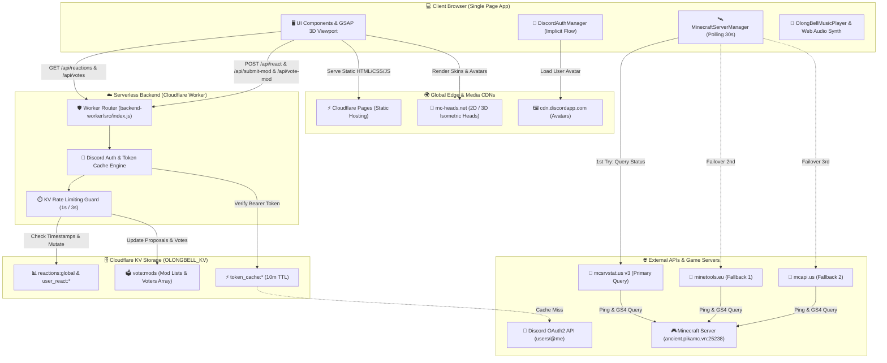

<div align="center">

  

  # 🦊 OlongBell SMP — Official Web Portal & Changelogs ⚔️
  
  **Trung tâm Nhật ký Cập nhật & Hệ Sinh Thái Máy Chủ Minecraft Fabric 26.2**
  
  *Giao diện Đồ họa 3D Cylinder • Server Radar Thời Gian Thực • Trình Phát Nhạc OST • Bình Chọn Mod Cộng Đồng*

  <p align="center">
    <a href="https://fabricmc.net/"></a>
    <a href="https://workers.cloudflare.com/"></a>
    <a href="https://discord.gg/37MB8CR28K"></a>
    <a href="https://greensock.com/gsap/"></a>
    
    
    
  </p>

  **[📡 Kết Nối Máy Chủ](#-2-thông-tin-máy-chủ-live-server-radar)** •
  **[✨ Tính Năng Nổi Bật](#-3-tính-năng-nổi-bật-key-features-showcase)** •
  **[🏛️ Kiến Trúc](#-4-sơ-đồ-kiến-trúc-hệ-thống-system-architecture)** •
  **[📚 REST API](#-5-bảng-tra-cứu-rest-api-documentation)** •
  **[🤝 Cộng Đồng](#-6-cộng-đồng-đóng-góp--bản-quyền-credits)**

</div>

---

## 📖 1. Giới thiệu Tổng quan (About Project)

**OlongBell Changelogs Web** là cổng thông tin điện tử chính thức và trung tâm tương tác của máy chủ **OlongBell SMP** — máy chủ sinh tồn Minecraft hiện đại vận hành trên nền tảng **Fabric 26.2 (Minecraft 1.21.1)**.

Dự án lấy cảm hứng từ linh vật hồ ly tinh nghịch **Shirakami Fubuki** (Hololive Gamers), kết hợp bảng màu cổ điển *Warm Linen & Charcoal Sand Gold* với ngôn ngữ thiết kế vi mô hiện đại. Trang web giải quyết trọn vẹn 5 nhu cầu thiết yếu của người chơi:
1. 📜 **Nhật Ký Cập Nhật Trực Quan:** Đọc và tương tác với các bản cập nhật lớn (v1.0.0 $\rightarrow$ v5.0.0) qua vòng xoay 3D hoặc danh sách thẻ bài chuẩn mực.
2. 📡 **Giám Sát Máy Chủ Thời Gian Thực:** Nắm bắt số lượng người chơi, kiểm tra ping, xem avatar 2D/3D của các thành viên đang online trong game.
3. 🎵 **Trải Nghiệm Thư Giãn:** Tận hưởng 6 bản nhạc nền lofi/chilled chọn lọc với trình phát đĩa than xoay động và âm thanh tổng hợp đa tần số.
4. 🗳️ **Dân Chủ Hóa Máy Chủ (Mod Voting):** Đăng nhập Discord an toàn để bình chọn hoặc đề xuất các mod mới từ CurseForge/Modrinth.
5. ⚡ **Cài Đặt Siêu Tốc (1-Click Installer):** Hỗ trợ lệnh PowerShell tự động hóa 100% quá trình cài đặt modpack cho người chơi mới.

---

## 📡 2. Thông tin Máy chủ (Live Server & Radar)

Người chơi có thể tham gia trực tiếp máy chủ sinh tồn OlongBell SMP thông qua thông số kết nối sau:

| Thông Số | Giá Trị Cấu Hình | Chú Thích Kỹ Thuật |
| :--- | :--- | :--- |
| **🌐 Public Server IP** | `olongbel.raumasmp.online` | Địa chỉ tên miền chính thức cho người chơi kết nối |
| **🛰️ Internal Query Host** | `ancient.pikamc.vn:25238` | Cổng truy vấn GS4 viễn thám người chơi và MOTD |
| **⚙️ Server Platform** | **Fabric 26.2 (Minecraft 1.21.1)** | Fabric Loader `0.19.3` • Fabric API `0.156.0+26.2` |
| **🔐 SFTP Port** | `ancient.pikamc.vn:2022` | Cổng truyền tải tệp dữ liệu máy chủ an toàn |
| **🤖 Remote MCP Admin** | `http://ancient.pikamc.vn:25240/mcp` | Máy chủ Model Context Protocol quản trị console |

> [!TIP]
> Trên giao diện web, bạn chỉ cần bấm vào ô **IP Máy Chủ** trên thanh Navbar để tự động sao chép địa chỉ `olongbel.raumasmp.online` vào bộ nhớ đệm (Clipboard) với âm báo phản hồi.

---

## ✨ 3. Tính năng Nổi bật (Key Features Showcase)

```
┌───────────────────────────────────────────────────────────────────────────────────────┐
│                               OLONGBELL SUITE FEATURES                                │
├───────────────────────┬───────────────────────────┬───────────────────────────────────┤
│  🪐 3D GSAP Cylinder  │  📡 Real-time Radar       │  🎵 Floating Vinyl OST Player     │
│  🗳️ Discord Mod Vote  │  ⚡ 1-Click PS1 Installer │  ✨ Constellation Cursor Follower │
└───────────────────────┴───────────────────────────┴───────────────────────────────────┘
```

### 🪐 3.1. GSAP 3D Cylinder Carousel & Standard Feed Switcher
- **Toán học Hình trụ Không gian:** Sử dụng hình học giải tích để xếp $N$ thẻ bài xung quanh một trục tròn xoay ảo với bán kính tối ưu:
  $$R = \frac{W / 2}{\tan(\pi / N)}$$
  *(với $W = 320\text{px}$ là bề rộng mỗi thẻ cập nhật).*
- **Cuộn Chuột Scrubbing:** Tích hợp [`GSAP 3.12.5 ScrollTrigger`](file:///C:/Users/giath/minecraft-changelogs-web/scripts/gsap-carousel.js) điều khiển góc xoay của sân khấu đủ $360^\circ$ theo tiến độ cuộn trang.
- **Kéo Thả Tự Nhiên (Drag-to-Rotate):** Hỗ trợ kéo chuột trái hoặc vuốt cảm ứng trên màn hình cảm ứng để xoay vòng xoay 3D với trạng thái chuột `grab`/`grabbing`.
- **Nhận Diện Thẻ Chính Diện (Active Front Card):** Tự động tính toán góc lệch để đẩy độ nét và độ mờ (opacity $1.0$ cho thẻ đối diện, hạ dần xuống $0.45$ cho các thẻ phía sau).
- **Bộ Chuyển Đổi Chế Độ Xem (View Mode Switcher):** Nút chuyển 1 chạm giữa **3D Preview** và **Standard Feed** (Danh sách thẻ truyền thống) kèm bộ lọc phân loại danh mục: *All, Features, Bug Fixes, Balance, Performance, Events*.

### 📡 3.2. Real-time Minecraft Server Radar
- **Kiến trúc Thăm dò Thác lũ (3-Tier Cascading Fallback):** Được quản lý bởi lớp [`MinecraftServerManager`](file:///C:/Users/giath/minecraft-changelogs-web/scripts/minecraft-server.js#L1-L200) nhằm đảm bảo tỷ lệ sống sót cao nhất của widget:
  1. *Cấp 1 (Primary):* `https://api.mcsrvstat.us/3/ancient.pikamc.vn:25238` (Timeout 8,000ms).
  2. *Cấp 2 (Fallback 1):* `https://api.minetools.eu/ping/ancient.pikamc.vn/25238` (Timeout 6,000ms).
  3. *Cấp 3 (Fallback 2):* `https://mcapi.us/server/status?ip=ancient.pikamc.vn&port=25238` (Timeout 6,000ms).
- **Roster Avatar Người Chơi 2D/3D:** Bóc tách danh sách người chơi online và hiển thị avatar trực tiếp từ `mc-heads.net` (`/avatar/{name}` và `/head/{name}` 3D isometric).
- **Observer Pattern:** Các thành phần UI (Header IP Box, Hero Radar, Live Badge) đăng ký lắng nghe sự kiện thay đổi dữ liệu máy chủ để tự động render lại sau mỗi chu kỳ 30 giây.

### 🎵 3.3. Floating Animated OST Music Player & Procedural Sound Synth
- **Trình Phát Đĩa Than Xoay Nổi:** Widget nghe nhạc thu nhỏ góc màn hình với đĩa than xoay tròn 360° khi phát (`.playing`), hiển thị thanh sóng âm dao động (Wave bars), playlist nổi và thanh trượt âm lượng mượt mà.
- **Playlist 6 Bản Nhạc Đặc Sắc:**
  1. `Mad Trick` (`assets/music/1.-Mad-Trick.mp3`)
  2. `Somebody` (`assets/music/4.-Somebody.mp3`)
  3. `Someday` (`assets/music/5.-Someday.mp3`)
  4. `Somewhere` (`assets/music/6.-Somewhere.mp3`)
  5. `Somehow` (`assets/music/Somehow.mp3`)
  6. `Snow Globe` (`assets/music/Snow Globe.mp3`)
- **Vượt Rào Cản Autoplay Của Trình Duyệt:** Tự động lắng nghe tương tác đầu tiên của người dùng (Click chuột, nhấn phím, click nút "Explore") hoặc kích hoạt sau khi màn hình loading kết thúc để chọn phát ngẫu nhiên 1 bản nhạc với âm lượng chuẩn hóa **`25%`** (tránh giật mình).
- **Tổng Hợp Âm Thanh Thủ Tục (Web Audio API Synthesizer):** Không dùng file audio rời, sử dụng trực tiếp các dao động sóng `sine` và `triangle` trong [`scripts/ui-interactions.js`](file:///C:/Users/giath/minecraft-changelogs-web/scripts/ui-interactions.js) để tạo hiệu ứng âm thanh tiếng chuông ngân (`playReactionSound`), tiếng bọt khí pop (`playVoteSound`) và âm trầm xóa mod (`playDeleteSound`).

### 🗳️ 3.4. Community Mod Voting & Discord OAuth2
- **Xác Thực Discord Implicit Grant:** Đăng nhập an toàn qua Discord OAuth2, tự động ẩn hash token trên URL thanh địa chỉ bằng `window.history.replaceState()`, tải avatar động từ Discord CDN.
- **Kiểm Duyệt Nguồn Mod Khắt Khe:** Bộ lọc Regex yêu cầu đường link đề xuất phải thuộc **CurseForge** (`curseforge.com/minecraft/mc-mods/...`) hoặc **Modrinth** (`modrinth.com/mod/...` hoặc `/project/...`).
- **Phân Quyền & Anti-Spam Toàn Diện:**
  - Token Discord được cache 10 phút tại Cloudflare KV để tránh bị Discord giới hạn lượt gọi (HTTP 429).
  - Rate limit cá nhân: Cách nhau 1 giây cho reaction, cách nhau 3 giây cho mỗi lần đề xuất mod.
  - Phân quyền Quản trị viên: Chỉ tài khoản Admin tối cao (`thinhdost`) mới có quyền xóa mod vi phạm trực tiếp từ giao diện.

### ⚡ 3.5. 1-Click PowerShell Modpack Installer
- **Tự Động Hóa 100% Khâu Cài Đặt:** Hộp giả lập terminal macOS/PowerShell với cú pháp màu trực quan, cho phép game thủ mới cài đặt toàn bộ modpack server mà không cần am hiểu kỹ thuật:
  ```powershell
  irm https://raw.githubusercontent.com/QuangquyNguyenvo/MineServer/main/26.2/UpdateMinecraftMods.ps1 | iex
  ```
- **Nút Sao Chép 1-Chạm:** Tích hợp phản hồi xúc giác đồ họa (đổi icon check xanh và thông báo đã sao chép).

### ✨ 3.6. Ambient Particle Spotlight Cursor Follower
- **Mạng Lưới Chòm Sao Tinh Tú (Constellation Canvas):** Tự động tính toán mật độ hạt dựa trên độ phân giải màn hình $\frac{\text{Width} \times \text{Height}}{14,000}$.
- **Tương Tác Vật Lý:** Vẽ các đường liên kết mạng nhện giữa các hạt trong bán kính $120\text{px}$ và kéo tia sáng vào con trỏ chuột trong bán kính $180\text{px}$. Khi con trỏ di chuyển vào vùng $<80\text{px}$, sinh lực đẩy hạt dạt ra xa (Repulsion Force).
- **Spotlight Hover Xuyên Tâm:** Bắt tọa độ chuột truyền vào biến CSS `--mouse-x` và `--mouse-y` để tạo hiệu ứng quầng sáng xuyên thấu theo con trỏ chuột trên từng thẻ cập nhật.

---

## 🏛️ 4. Sơ đồ Kiến trúc Hệ thống (System Architecture)

Dưới đây là sơ đồ luồng dữ liệu toàn cảnh giữa Client Trình duyệt, Backend Cloudflare Worker, Cơ sở dữ liệu phân tán KV, Máy chủ Discord API và Máy chủ Minecraft Query:



---

## 📚 5. Bảng Tra cứu REST API (Documentation)

Hệ thống API backend được định tuyến trực tiếp trong [`backend-worker/src/index.js`](file:///C:/Users/giath/minecraft-changelogs-web/backend-worker/src/index.js), trang bị đầy đủ CORS Header, Rate Limiting và kiểm soát phân quyền.

| Phương Thức | Đường Dẫn API | Xác Thực | Hạn Mức Tần Suất | Mục Đích & Mô Tả Chức Năng |
| :---: | :--- | :---: | :---: | :--- |
| `GET` | `/api/reactions` | Không | Không giới hạn | Lấy thống kê số lượt thả cảm xúc toàn cầu của các bản cập nhật từ KV (`reactions:global`). |
| `POST` | `/api/react` | Bearer Token | 1 giây / user | Thả hoặc hủy cảm xúc cho một phiên bản cập nhật (`like`, `love`, `fire`). |
| `GET` | `/api/votes` | Không | Không giới hạn | Lấy danh sách toàn bộ các mod đề xuất và danh sách voter từ KV (`vote:mods`). |
| `POST` | `/api/submit-mod` | Bearer Token | 3 giây / user | Đề xuất một mod mới (Kiểm tra regex CurseForge / Modrinth, chống trùng lặp URL). |
| `POST` | `/api/vote-mod` | Bearer Token | Không giới hạn | Bỏ phiếu ủng hộ hoặc rút lại phiếu ủng hộ (Toggle) cho một đề xuất mod. |
| `POST` | `/api/delete-mod` | Bearer Token | **Admin Only** | Xóa mod khỏi danh sách (Chỉ tài khoản admin tối cao `thinhdost` mới có quyền thực thi). |

### Chi Tiết Cấu Trúc Payloads:

<details>
<summary><b>🔍 Xem chi tiết Payload mẫu của từng Endpoint (Bấm để mở)</b></summary>

#### 1. Thả cảm xúc (`POST /api/react`)
- **Headers:** `Authorization: Bearer <Discord_Access_Token>`
- **Request Body:**
  ```json
  {
    "logId": "v5.0.0",
    "type": "fire"
  }
  ```
- **Response Success (200 OK):**
  ```json
  {
    "success": true,
    "userReact": "fire",
    "global": {
      "v5.0.0": { "like": 14, "love": 28, "fire": 45 }
    }
  }
  ```

#### 2. Đề xuất Mod mới (`POST /api/submit-mod`)
- **Headers:** `Authorization: Bearer <Discord_Access_Token>`
- **Request Body:**
  ```json
  {
    "name": "Sodium Fabric",
    "url": "https://modrinth.com/mod/sodium"
  }
  ```
- **Response Success (200 OK):**
  ```json
  {
    "success": true,
    "mod": {
      "id": "e4f8d9b1-7a6c-4821-bc29-87c126d4002e",
      "name": "Sodium Fabric",
      "url": "https://modrinth.com/mod/sodium",
      "submittedBy": { "id": "123456789", "username": "player_steve" },
      "votes": 1,
      "voters": ["123456789"],
      "createdAt": 1727623800000
    }
  }
  ```

#### 3. Bỏ phiếu cho Mod (`POST /api/vote-mod`)
- **Headers:** `Authorization: Bearer <Discord_Access_Token>`
- **Request Body:**
  ```json
  {
    "modId": "e4f8d9b1-7a6c-4821-bc29-87c126d4002e"
  }
  ```
- **Response Success (200 OK):**
  ```json
  {
    "success": true,
    "voted": true,
    "votes": 2
  }
  ```

</details>

---

## 🤝 6. Cộng đồng, Đóng góp & Bản quyền (Credits)

### 💬 Tham Gia Cộng Đồng OlongBell SMP
- **Discord Chính Thức:** [https://discord.gg/37MB8CR28K](https://discord.gg/37MB8CR28K) — Nơi giao lưu, giải đáp thắc mắc, đề xuất tính năng và tham gia các sự kiện ingame hấp dẫn.
- **Báo Lỗi & Đóng Góp:** Mọi phản hồi xin vui lòng tạo Issue trên GitHub hoặc gửi tin nhắn trực tiếp cho Ban Quản Trị tại kênh `#gop-y-server`.

### 🛡️ Khôi Phục Nhanh Khi Gặp Sự Cố
Nếu phát sinh xung đột mã nguồn hoặc tệp tin bị hỏng trong quá trình phát triển, hãy tham khảo tài liệu [`BACKUP_RESTORE_GUIDE.md`](file:///C:/Users/giath/minecraft-changelogs-web/BACKUP_RESTORE_GUIDE.md) để khôi phục trạng thái chuẩn mực nguyên bản từ thư mục sao lưu [`backup_state/`](file:///C:/Users/giath/minecraft-changelogs-web/backup_state/) bằng lệnh:
```powershell
Copy-Item -Path "backup_state\*" -Destination "." -Recurse -Force
```

### 📜 Bản Quyền & Miễn Trừ Trách Nhiệm (Disclaimer)
- Dự án mã nguồn mở được phát hành theo giấy phép **MIT License**.
- **Minecraft** là thương hiệu đã đăng ký của Mojang Synergies AB / Microsoft. Dự án này là sản phẩm phi thương mại của cộng đồng người hâm mộ và không liên kết, tài trợ hoặc chứng thực bởi Mojang hoặc Microsoft.
- Hình ảnh và nhân vật linh vật **Shirakami Fubuki** thuộc bản quyền sáng tạo của tập đoàn **Cover Corp / Hololive Production**.

---

<div align="center">
  <sub>Được thiết kế và duy trì với tất cả tình yêu dành cho cộng đồng Minecraft và Shirakami Fubuki 🌽</sub><br/>
  <b>Crafted with ❤️ by OlongBell Developer & Architecture Team</b>
</div>
